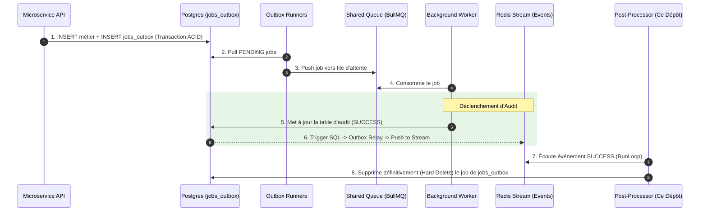

# Architecture & Design Document

## Architecture Overview

L'architecture des `post-processors-runners` est hautement réactive et résiliente, conçue spécifiquement pour la consommation à haut débit de Redis Streams. 
Plutôt que d'implémenter une logique complexe dans chaque runner métier, l'intégralité de la tuyauterie distribuée est abstraite dans le composant partagé `@volontariapp/post-processors`. Chaque runner métier (ex: `post-processor-user`) se contente d'hériter de `SinglePostProcessor` ou `BatchPostProcessor` pour injecter sa logique d'exécution.

## Internals : Les 4 Boucles Asynchrones

Pour garantir qu'aucun message n'est perdu (orphaned) ou bloqué indéfiniment, l'architecture s'appuie sur quatre boucles parallèles s'exécutant en tâche de fond de manière autonome.

```mermaid
graph TD
    RedisStream[(Redis Stream)]
    
    subgraph Loops [Post-Processor Background Loops]
        RL[RunLoop]
        CL[ClaimLoop]
        Retry[RetryLoop]
        DLQSync[DlqSyncLoop]
    end
    
    RL -->|Lecture dynamique (XREADGROUP)| RedisStream
    CL -->|Récupération des messages orphelins (Pending)| RedisStream
    Retry -->|Ré-injection des messages en erreur transitoire| RL
    DLQSync -->|Nettoyage asynchrone des vieilles entrées DLQ| RedisStream
```

## Data Flow : Distributed Job Outbox & Audit Loop

L'un des cas d'usage majeurs de ces runners est la clôture du cycle de vie du pattern Outbox. L'objectif est de nettoyer la table `jobs_outbox` de manière asynchrone une fois qu'un job a été traité avec succès par un worker distant.



## Design Decisions & Trade-offs

### 1. Protection par Circuit Breaker
- **Décision** : Intégrer un pattern Circuit Breaker natif dans `BasePostProcessor`.
- **Raison** : Lorsqu'un post-processor dépend d'une API externe ou d'une base de données dégradée, forcer la consommation d'événements conduit à une cascade d'erreurs, saturant le réseau et empêchant le composant aval de récupérer. Le Circuit Breaker coupe la boucle de lecture (Open State) si le seuil d'erreurs est atteint, puis effectue des tests sporadiques (Half-Open State).
- **Compromis** : Augmente le délai (lag) de consommation pendant la phase d'ouverture du circuit, mais protège l'intégrité globale du système.

### 2. NestJS "Standalone Application Context"
- **Décision** : Instancier NestJS sans serveur HTTP (`NestFactory.createApplicationContext()`), tout en exposant manuellement un port Node `http` pour les Health Checks.
- **Raison** : Économie massive de RAM et de temps de CPU au démarrage par rapport à l'initialisation du moteur Express/Fastify et du routage complexe, tout en conservant les avantages de `@Injectable()` et des cycles de vie (`OnModuleInit`). L'empreinte carbone et financière sur Kubernetes s'en trouve grandement réduite.

### 3. Traitement Batch (BatchPostProcessor) vs Single
- **Décision** : Permettre au développeur d'opter pour le traitement groupé (Batch) ou unitaire (Single) par typologie d'événement.
- **Raison** : Les opérations I/O (comme les insertions PostgreSQL multiples ou les requêtes vers Elasticsearch) sont des dizaines de fois plus rapides si elles sont vectorisées (Bulk Insert). À l'inverse, l'envoi d'e-mails transactionnels nécessite une isolation stricte (Single).
- **Trade-off** : L'implémentation Batch complexifie la gestion partielle des erreurs (si 1 item sur 50 échoue dans le batch, l'idempotence et les DLQ doivent gérer cette granularité fine sans retraiter les 49 succès).
