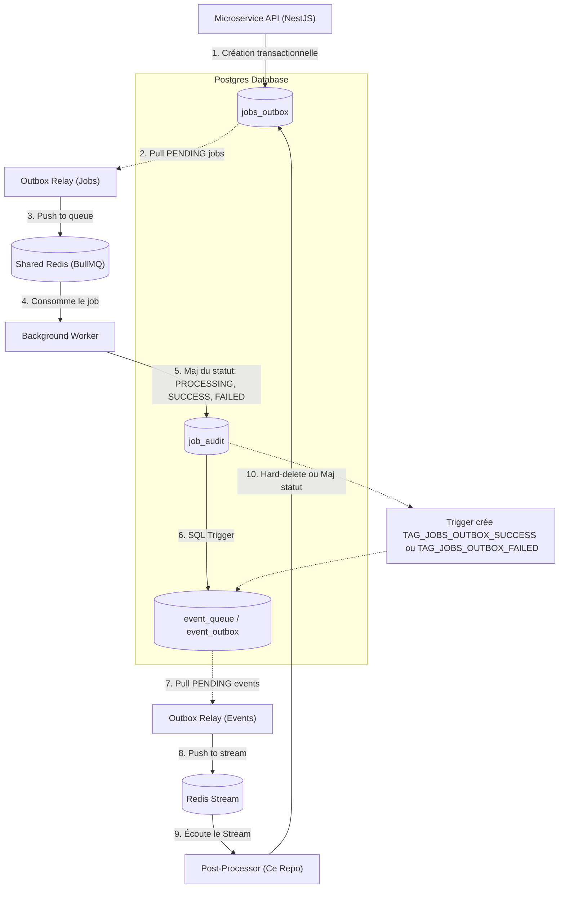

# Volontariapp Post-Processors Fleet

Ce dépôt héberge la flotte de **Post-Processors Runners** de Volontariapp. Ces services constituent le dernier maillon de notre architecture événementielle basée sur le pattern Transactional Outbox. Ils s'assurent de la synchronisation, du nettoyage et de la mise à jour d'état des jobs en base de données suite à leur publication réussie dans les Streams Redis.

L'architecture est entièrement construite sur des **Contextes d'Application Standalone NestJS** (sans pile HTTP), garantissant une empreinte mémoire minimale et un démarrage instantané, tout en conservant la puissance de l'injection de dépendances de NestJS. Les runners intègrent également un **Serveur de Diagnostic** (Health Check) allégé natif Node.js pour assurer le monitoring en production sans nécessiter de serveur HTTP complexe.

---

## Cas d'Usage Complet : Distributed Job Outbox & Audit Loop

Pour garantir une communication résiliente et une livraison de messages de type *at-least-once*, notre architecture s'appuie sur le pattern Transactional Outbox. Les Post-Processors viennent s'inscrire en fin de chaîne pour réconcilier les états.

Le diagramme ci-dessous illustre le parcours complet d'un Job, de sa création à son nettoyage final :



### Détail du Flux :
1. **Création** : Le Microservice (`microservice-A`) sauvegarde en base de données un objet métier métier et un Job (`job-A`) de façon transactionnelle. Le Job est persisté dans `jobs_outbox`.
2. **Relais des Jobs** : Un processus Outbox scrute la table `jobs_outbox` et envoie le Job dans une file d'attente Redis partagée (BullMQ).
3. **Exécution** : Un Worker dédié (`worker-A`) consomme le Job et enregistre ses états successifs (`PROCESSING`, puis `SUCCESS` ou `FAILED`) dans la table d'audit `job_audit`.
4. **Trigger Automatique** : Un trigger SQL au niveau de PostgreSQL détecte l'insertion dans `job_audit`. S'il s'agit d'un état terminal, il génère un événement dans `event_queue`.
5. **Relais des Événements** : Un second processus Outbox récupère ces événements en attente et les publie dans un **Redis Stream**.
6. **Closing the Loop (Post-Processors)** : Notre Post-Processor (ce dépôt) écoute le Stream. Lorsqu'il reçoit un événement de succès (`TAG_JOBS_OUTBOX_SUCCESS`), il supprime définitivement le `job-A` d'origine de la table `jobs_outbox`, clôturant ainsi le cycle de manière fiable.

---

## Organisation de la Flotte de Post-Processors

Chaque microservice runner est modulaire et autonome (avec son propre `package.json` et sa configuration `class-validator`), et expose son propre port de diagnostic :

```
post-processors-runner/
├── post-processor-user/            # Stream utilisateur
├── post-processor-event/           # Stream évènements
├── post-processor-post/            # Stream publications
└── post-processor-social/          # Stream réseau social
```

### Registre des Binds Port & Redis Stream

Les groupes de consommateurs (Consumer Groups) et les Streams écoutés sont typés et configurés dans nos packages centraux :

| Nom du Runner | Port Diagnostic | Redis Stream | Consumer Group | Modèle Cible |
| :--- | :---: | :--- | :--- | :--- |
| **`post-processor-user`** | `4201` | `stream:ms-user` | `post-processor-user` | `JobsOutboxModel` |
| **`post-processor-post`** | `4202` | `stream:ms-post` | `post-processor-post` | `JobsOutboxModel` |
| **`post-processor-event`** | `4203` | `stream:ms-event` | `post-processor-event` | `JobsOutboxModel` |
| **`post-processor-social`**| `4204` | `stream:ms-social` | `post-processor-social`| `JobsOutboxModel` |

---

## Deep-Dive Architectural & Concepts Avancés

### 1. Contextes d'Application Standalone NestJS
Comme nos Workers, ces runners utilisent des **Contextes d'Application Standalone**.
En bootstrapant l'application via `NestFactory.createApplicationContext()`, nous obtenons les avantages du conteneur IoC (Inversion of Control) sans allouer les ressources d'un framework HTTP lourd. Les instances tournent en fond pour consommer les streams de façon continue.

### 2. Serveur de Diagnostic Node Natif
Au lieu d'utiliser Express ou Fastify pour les Health Checks (`/health`), la librairie `@volontariapp/post-processors` fournit un **DiagnosticServer** utilisant nativement le module `node:http`. Il interroge nos `PostgresBridgeHealthProvider` et `RedisBridgeHealthProvider` pour remonter une erreur 503 à l'orchestrateur (Kubernetes/Docker) si la base de données ou Redis est injoignable, le tout avec un impact nul sur les performances.

### 3. Validation Typée et Types Sûrs (CI)
Nos DTOs de configuration (`CustomConfig`) valident l'environnement (`class-validator` / `class-transformer`) dès l'initialisation. Une stricte validation TypeScript est assurée dans la CI. (L'utilisation de la directive `eslint-disable @typescript-eslint/no-unsafe-call` peut être employée ponctuellement pour contourner les limitations des caches CI avec le module de typage de class-validator).

### 4. Cycle de Vie Propre (Graceful Shutdown)
Les `AppModule` implémentent `OnModuleDestroy`. Dès réception de `SIGINT` ou `SIGTERM`, le serveur de diagnostic est coupé, et les providers (Postgres et Redis) libèrent leurs sockets proprement, évitant ainsi des fuites de mémoire ou des connexions orphelines en production.

---

## Command Center — command.sh (À Venir)

Un système de scripts utilitaires similaire à celui des workers pour gérer le démarrage local (`yarn run:all`), le lint global ou l'installation des dépendances dans toute la flotte.

---

## Intégration Continue (CI/CD)

Le projet dispose d'une CI via **GitHub Actions** qui garantit :
1. **Linter** : Validation du code via ESLint (`yarn lint`).
2. **Build** : Transpilation et vérification stricte du typage (`yarn build`).
3. **Docker Build** : Validation de la configuration Yarn v4 Berry avec son résolveur `node-modules` encapsulé par notre `.yarnrc.yml` distribué pour s'assurer que les conteneurs montent sans erreurs et récupèrent bien leurs dépendances en CI.
4. **Déploiement** : (Optionnel) Déploiement automatisé des images de post-processors sur le cluster.
